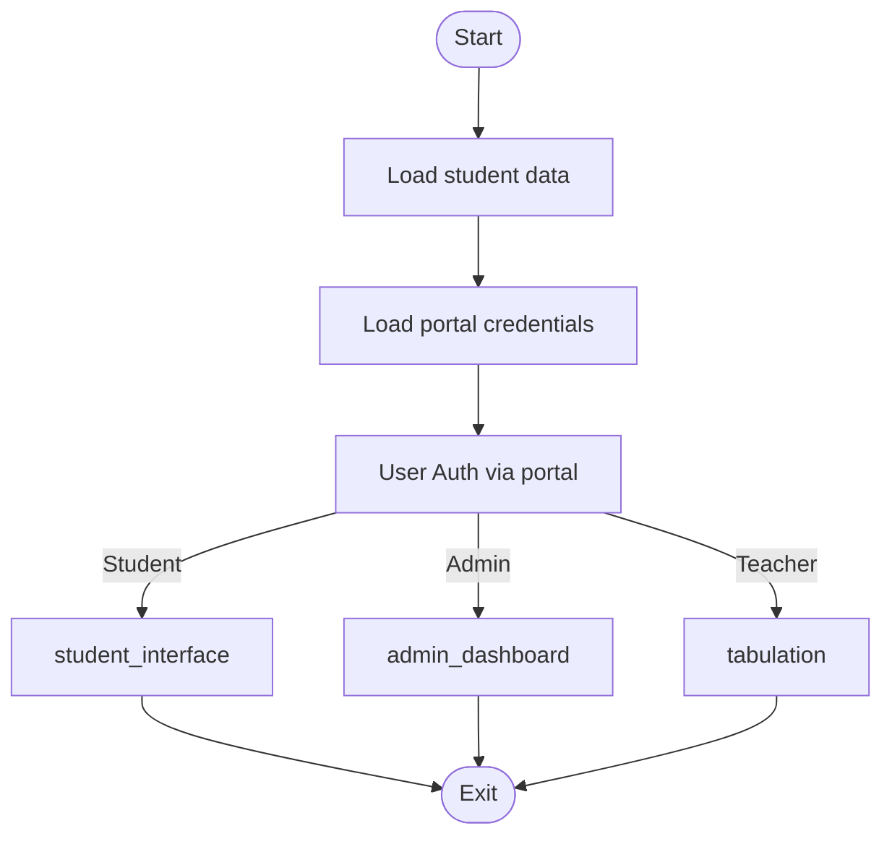
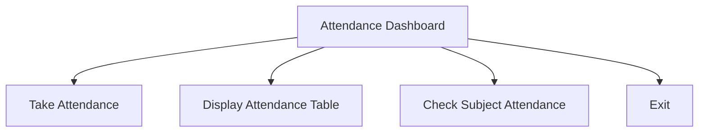
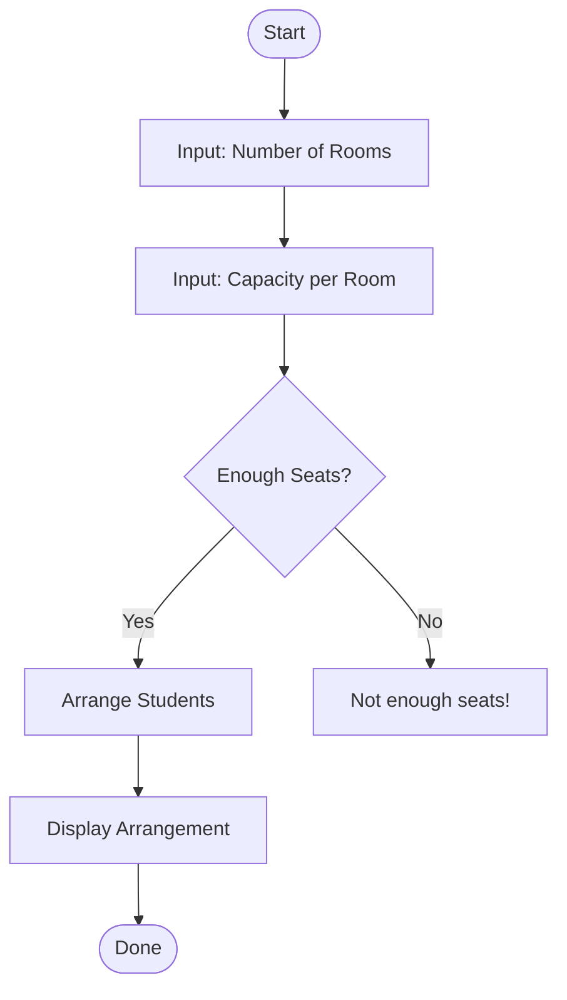
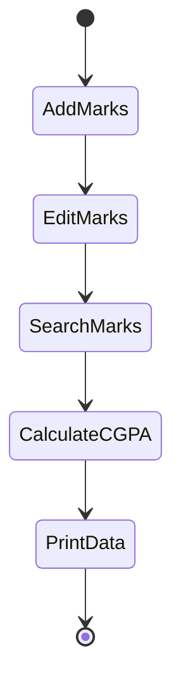
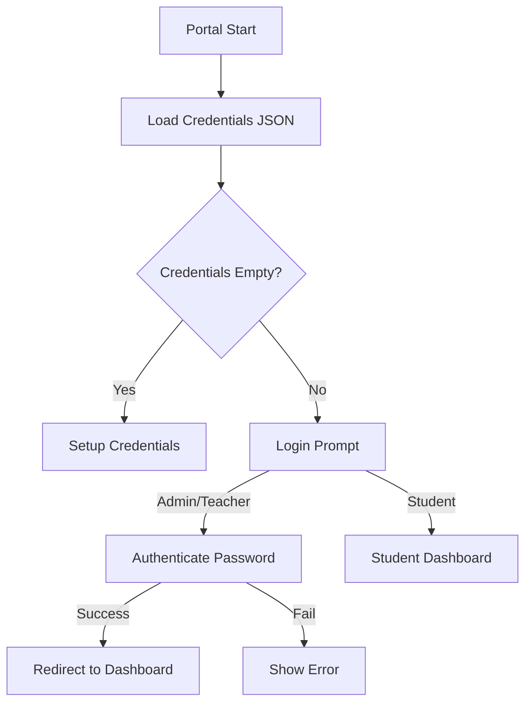
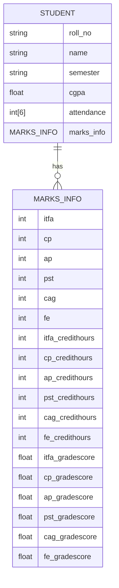
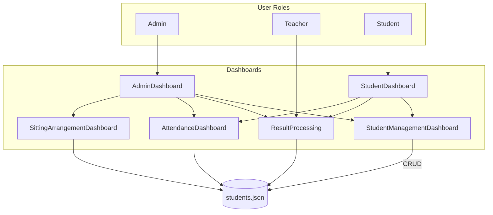

# CPP1-EMS — Examination Management System

CPP1-EMS is a **C language based Examination Management System** developed as a **Computer Programming (CP) course project**.  
The system manages students, attendance, exam results, seating arrangements, and user authentication using **JSON file storage**.

This project is suitable for **students, beginners, and academic demonstrations**.

---

## Features

- Student Management (Add, Update, Delete, View)
- Attendance Management
- Result Processing & CGPA Calculation
- Exam Seating Arrangement
- Role-Based Login System (Admin / Teacher / Student)
- JSON-based Data Storage (No Database Required)
- Console-based Interactive Menus

---

## Tech Stack

- **Language:** C
- **Data Storage:** JSON files
- **Compiler:** GCC
- **Platform:** Windows / Linux / macOS

---

## Installation Guide

Follow the steps below to install and run the **CPP1-EMS (Examination Management System)** on your local machine.

---

### Prerequisites

Before starting, make sure you have:

- **GCC Compiler** installed  
- **Git** (optional, for cloning)
- A **terminal / command prompt**
- Basic knowledge of C programming

Check GCC installation:

    gcc --version

---

## Step 1: Clone the Repository

Clone the project from GitHub:

    git clone https://github.com/Ali309455/CPP1-EMS.git

Navigate into the project directory:

    cd CPP1-EMS

---

## Step 2: Compile the Project

Compile all source files using GCC:

    gcc main.c Portal.c studentmanagement.c attendancemanagement.c resultprocessing.c sittingarrangement.c cJSON.c -o EMS

If compilation succeeds, an executable file will be created.

---

## Step 3: Run the Application

### On Windows

    EMS.exe

### On Linux / macOS

    ./EMS

---

## Step 4: Verify Execution

After running the program:

- A menu-driven interface will appear
- Select a role (Admin / Teacher / Student)
- Navigate using numeric options

All data is automatically saved in JSON files.

---

## Data Files Used

The project uses JSON-based storage:

- `students.json` — student records
- `credentials.json` — login credentials

Ensure these files exist in the project directory.

---

## Common Issues & Fixes

### GCC Not Found

Install GCC:

- **Windows:** Install MinGW
- **Linux:**
  
      sudo apt install gcc

- **macOS:**
  
      xcode-select --install

---

### Permission Denied (Linux / macOS)

    chmod +x EMS
    ./EMS

---

##Installation Complete

You have successfully installed and executed **CPP1-EMS** 🎉  
You can now explore all features of the Examination Management System.


# EMS Documentation

This documentation covers the main files of a C-based Examination Management System (EMS). The system handles student management, attendance, result processing, sitting arrangements, user credential management, and JSON data serialization. Below, each file's purpose, structure, and operation are described in detail.

---

## main.c

This is the entry point for the EMS application. It manages user roles (student, teacher, admin) and directs users to the appropriate dashboard.

**Key Responsibilities:**

- Loads student and credentials data.
- Handles user authentication and portal access.
- Directs users to student or admin interfaces.
- Cleans up memory before exit.

**Main Components:**

| Function               | Description                                                    |
|------------------------|----------------------------------------------------------------|
| `main`                 | Entry point. Loads data, credentials, and routes users.        |
| `student_interface`    | Student dashboard: view info, marks, attendance, or exit.      |
| `admin_dashboard`      | Admin dashboard: security, student management, result processing, attendance, sitting arrangement, or exit. |

**Sample Dashboard Menu Flow:**



---

## attendancemanagement.c

Manages the attendance records for students across subjects.

**Key Responsibilities:**

- Enables attendance entry for each student and subject.
- Displays attendance in a tabular format.
- Calculates and displays attendance statistics for specific subjects.

**Main Components:**

| Function                | Description                                                |
|-------------------------|------------------------------------------------------------|
| `takeAttendance`        | Loops through subjects and students to record attendance.  |
| `displayAttendance`     | Shows an attendance table with present/absent status.      |
| `checkTotalAttendance`  | Provides subject-wise attendance statistics.               |
| `attendance_management` | Interactive dashboard for attendance-related actions.      |

**Attendance Management Workflow:**



---

## sittingarrangement.c

Handles the rule-based allocation of students into rooms for exams.

**Key Responsibilities:**

- Allocates students to rooms based on roll number.
- Takes room count and capacity as input.
- Ensures no overflow of students beyond room capacity.

**Main Components:**

| Function             | Description                                    |
|----------------------|------------------------------------------------|
| `sittingArrangement` | Asks for room details, arranges students, and displays the allocation. |

**Arrangement Workflow:**



---

## resultprocessing.c

Handles student marks, grade calculation, CGPA calculation, and result viewing/editing.

**Key Responsibilities:**

- Add, edit, search, and delete marks for students.
- Calculate grades and CGPA.
- Display results in tabular form.

**Main Components:**

| Function              | Description                                                  |
|-----------------------|--------------------------------------------------------------|
| `grade_points`        | Converts marks into grade points.                            |
| `add_marks_data`      | Adds marks for each student and subject.                     |
| `edit_marks_data`     | Edits marks for a specific student by roll number.           |
| `search_marks_data`   | Finds and displays marks for a student.                      |
| `calculate_cgpa`      | Computes CGPA for students based on subject grade scores.    |
| `tabulation`          | Main menu for result processing options.                     |

**Result Processing State Diagram:**



---

## Portal.c

Manages authentication, credential storage, password management, and security questions for the EMS portal.

**Key Responsibilities:**

- Loads/saves credentials from/to a JSON file.
- Handles login for students, teachers, and admins.
- Supports password change and recovery using security questions.
- Handles first-time setup of credentials.

**Main Components:**

| Function            | Description                                                |
|---------------------|------------------------------------------------------------|
| `load_credentials`  | Reads portal credentials from a JSON file.                 |
| `save_password`     | Writes updated credentials (passwords, security answers) to file. |
| `forget_password`   | Recovers password using security questions.                |
| `change_password`   | Changes password for teacher/admin, or calls password recovery. |
| `Admin_interface`   | Security dashboard for password management.                |
| `first_time_login`  | First-time credential setup.                               |
| `login`             | Authenticates user and returns role/status.                |
| `portal`            | Orchestrates the login flow and credential loading.        |

**Authentication Flow:**



---

## studentmanagement.c

Manages CRUD operations for student data and handles persistence via JSON serialization.

**Key Responsibilities:**

- Add, display, search, edit, and delete student records.
- Save and load student data from JSON files.
- Presents a dashboard for student management.

**Main Components:**

| Function             | Description                                                |
|----------------------|------------------------------------------------------------|
| `saveDataArray`      | Serializes student records to JSON and writes to disk.     |
| `addStudent`         | Adds one or more students to the system.                   |
| `displayStudents`    | Lists all students.                                        |
| `searchStudent`      | Finds a student by roll number.                            |
| `editStudent`        | Updates a student's information.                           |
| `deleteStudent`      | Removes a student record.                                  |
| `loadData`           | Loads records from the JSON file.                          |
| `menu`               | Interactive dashboard for managing students.               |

**Entity Relationship Diagram:**



---

## cJSON.c

This is a third-party C library for parsing and serializing JSON data. It is used to:

- Serialize complex student and credential data structures into JSON.
- Parse JSON back into C structs for use by the EMS.

**Key Features:**

- Full support for JSON objects, arrays, strings, and numbers.
- Case-insensitive parsing and pretty-printing support.
- Functions for creating, manipulating, and deleting JSON objects and arrays.

**Commonly Used Functions:**

| Function                   | Description                                                  |
|----------------------------|--------------------------------------------------------------|
| `cJSON_Parse`              | Parses a JSON string into a cJSON object.                    |
| `cJSON_Print`              | Serializes a cJSON object into a formatted JSON string.      |
| `cJSON_GetObjectItem`      | Retrieves an item from a JSON object by key.                 |
| `cJSON_AddItemToObject`    | Adds an item to a JSON object.                               |
| `cJSON_Delete`             | Frees a cJSON object from memory.                            |

**Note:**  
You rarely need to interact with cJSON directly. Instead, the EMS uses it internally to store and retrieve structured data.

---

## main.exe

This is the compiled executable for the Examination Management System.  
You run this file to launch the EMS on your system.

```card
{
    "title": "main.exe Usage",
    "content": "This is the compiled binary. Run it to use the Examination Management System via CLI."
}
```

---

# 🎯 EMS Architecture Overview



---

# Security & Data Handling

- **Credentials** (admin/teacher passwords, security questions) are stored in `credentials.json` and managed securely via the Portal module.
- **Student data** (including marks and attendance) is stored in `students.json`, serialized/deserialized using cJSON.
- **Role-based access** ensures only authorized users can perform sensitive operations.

---

# Best Practices

```card
{
    "title": "Data Integrity & Security",
    "content": "Always use the inbuilt dashboard options for data changes. Do not manually edit the JSON files."
}
```

---

# Appendix: Example API Blocks

The EMS is a C CLI application and does **not** expose HTTP API endpoints. However, if you adapt this system for web use, you can model API endpoints for key operations such as creating students, managing attendance, and processing results.

---

# Summary Table

| Module/File            | Core Responsibility                              | Data Stored/Used   |
|------------------------|--------------------------------------------------|--------------------|
| main.c                 | Entry, role routing, dashboards                  | All user data      |
| attendancemanagement.c | Attendance input, display, statistics            | students.json      |
| sittingarrangement.c   | Room assignments                                 | students.json      |
| resultprocessing.c     | Marks/grades management, CGPA calculation        | students.json      |
| Portal.c               | Authentication, credential management            | credentials.json   |
| studentmanagement.c    | CRUD for student records                         | students.json      |
| cJSON.c                | JSON parsing/serialization (utility library)     | students.json, credentials.json |
| main.exe               | Compiled EMS application                         | n/a                |

---

# Final Notes

- The EMS is modular, with clear separation between student data, results, attendance, and authentication.
- It relies on standard C programming practices and file-based persistence using JSON.
- The system can be extended for further features (e.g., online APIs, GUI).

For further customization or integration with other systems, consider abstracting file storage and authentication for more scalable deployments.

---
